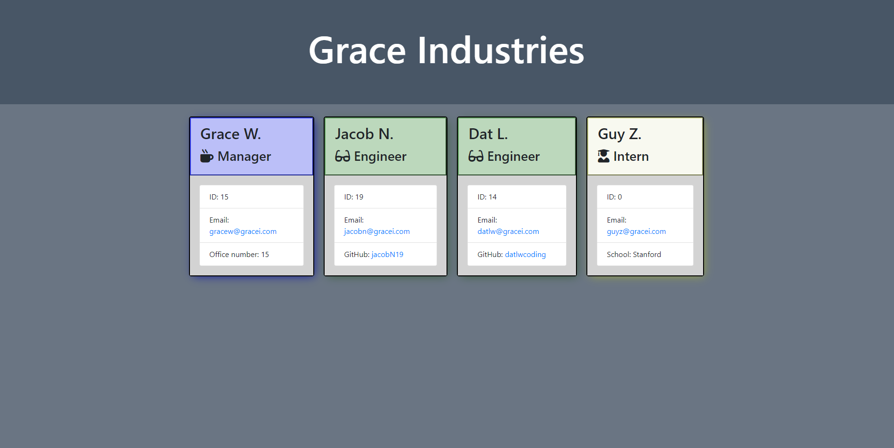

### **Last Updated**: 

9/27/2020
## Table Of Contents: 
[Image](#Image)
[Deployed Link](#Deployed-Link)
[Last Updated Date](#Last-Updated-Date)
[Table of Contents](#Table-of-Contents)
[About](#About)
[Badges](#Badges)
[Usage](#Usage)

### [Click here to launch this application.]()

#### Badges

# About

Generate your team onto a nicely formatted web page. Keep track of your team's contact information using this application.

## Usage
1. Run `node .` using CLI while inside the directory
2. Follow the instructions to generate your team roster.

